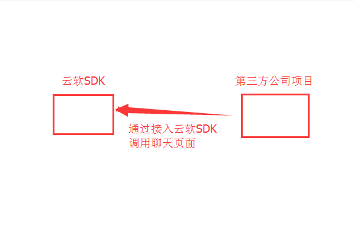
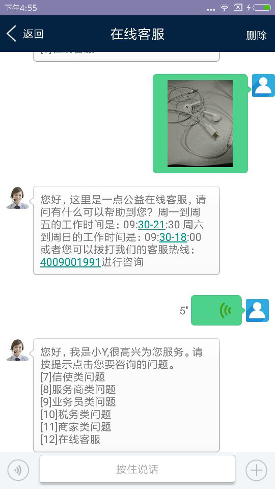
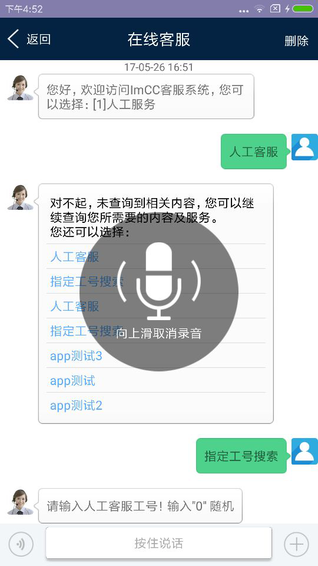
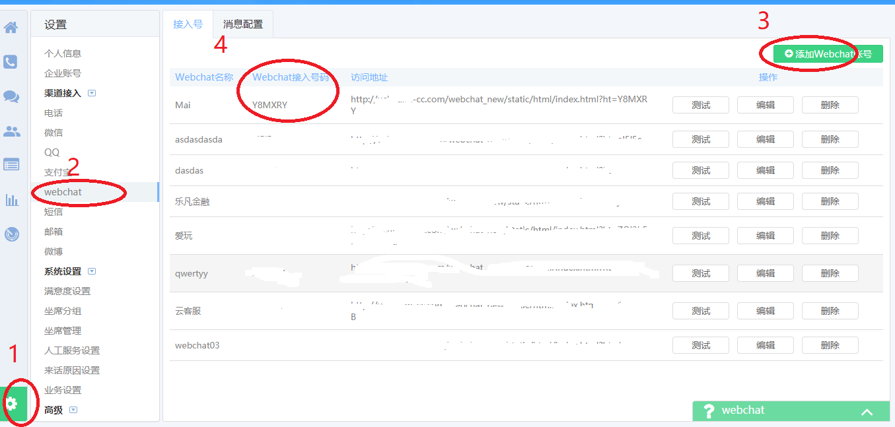
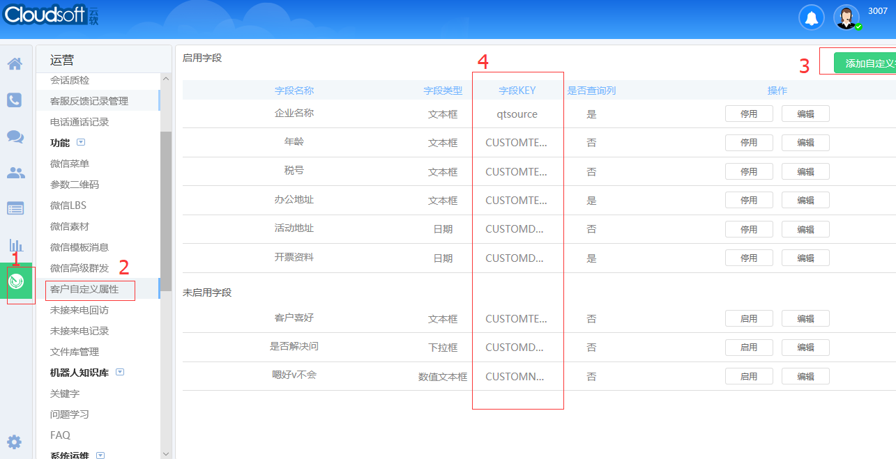
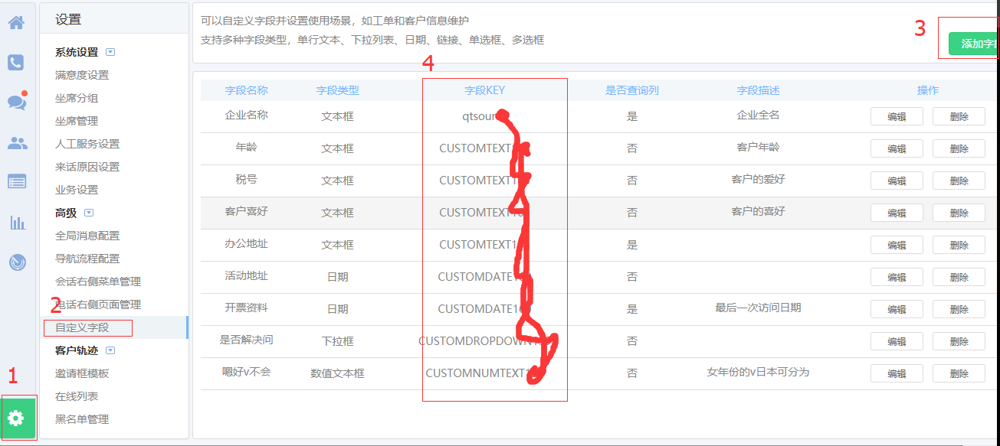

# WebChat Android SDK


使用
-----
Webchat sdk 是一个可自定义的嵌入式聊天SDK。
可实现文字 图片 表情聊天 服务器自动回复 以及人工客服。
### 一、WebChat SDK 接入流程


### 二、接入SDK后的效果图
支持文字、录音，图片发送以及接收的交互，具体看效果图



### 三、AndroidStdio接入方式如下：

**1. 添加Gradle依赖:**

**Gradle dependency**

  -  在你**项目project**层级的`build.gradle`添加以下代码：

```gradle
allprojects {
	repositories {
		maven { url "https://raw.github.com/CloudSoft-Team/webchat-android-sdk/master" }
	}
}
```
  -  在你**App/模块moudle**层级的 `build.gradle`添加以下代码：

```gradle
dependencies {
	compile 'chat.icloudsoft:webchat-android-sdk:1.1.7@aar'
}
```


**2. 在你**App/模块moudle**层级的 `build.gradle`添加相关依赖：**

```
compile 'com.android.support:appcompat-v7:22.2.0'
compile 'com.android.support:cardview-v7:22.0.0'
compile'com.android.support:recyclerview-v7:22.0.0'
compile 'com.android.support:support-v4:22.0.0'
compile 'com.squareup.retrofit2:retrofit:2.0.2'
compile 'com.squareup.retrofit2:converter-gson:2.0.2'
compile 'com.squareup.picasso:picasso:2.5.2'
```

**3. 添加相应的权限：**

```
<uses-permission android:name="android.permission.ACCESS_NETWORK_STATE"/>
<uses-permission android:name="android.permission.INTERNET" />
<uses-permission android:name="android.permission.WRITE_EXTERNAL_STORAGE" />

<uses-permission android:name="android.permission.MOUNT_UNMOUNT_FILESYSTEMS" />
<uses-permission android:name="android.permission.READ_EXTERNAL_STORAGE"/>
<uses-permission android:name="android.permission.RECORD_AUDIO"/>
```

**4. 在项目的自定义Application里初始化：**

```
public class App extends Application {

    // 生产环境
    public static final String BASE_URL = "ws://u.im-cc.com:17998/httpif";
    public static final String UPLOAD_URL = "http://uccfile.im-cc.com/";//文件上传的url测试
    public static final String DOWNLOAD_URL = "http://uccfile.im-cc.com/download/";//文件下载的url

    @Override
    public void onCreate() {
        super.onCreate();
        AppUtil.init(getAppContext(), BASE_URL, DOWNLOAD_URL, UPLOAD_URL);
   } 
```

**5. 在调用的地方传递了两个参数 hostname 跟custid：**

示例：
hostName:接入号

Custid：app用户的唯一标志，必须是字符、数字和"_"组成，不能是中文以及特殊符号, 建议和ios端保持统一的命名格式
```
Intent it = new Intent(MainActivity.this, SessionDetailsActivity.class);
it.putExtra("hostNum","Y8MXRY");
it.putExtra("custId","13510534912");
it.putExtra("imUserNick","Lucky");
startActivity(it);
```
hostNum来源：请在[客服网页](http://u.im-cc.com)用管理账号登陆，根据下图的步骤获取hostNum


**6. 给客服坐席传其他字段，如：性别，昵称等**

```
imUserNick  ：昵称如：lucky
imUserGender：性别 2:女性 1：男性
imUserCityId：城市 深圳
imUserBirthday：生日 1999-09-09
imUserIP：ip地址 192.10.11.11
strIMUserheadimgurl：头像url  http://baidu/1.png

```
例如，给客服坐席传递用户的性别和昵称
```
Intent it = new Intent(MainActivity.this, SessionDetailsActivity.class);
it.putExtra("hostNum","Y8MXRY");
it.putExtra("custId","13510534912");
it.putExtra("imUserNick","Lucky"); // 用户昵称
it.putExtra("imUserGender","女"); // 用户性别
startActivity(it);
```

**7. 自定义属性：如自定义电话、客户id**

```
List<PropertyBean> list = new ArrayList<PropertyBean>();

PropertyBean bean1 = new PropertyBean();
bean1.key = "自定义的字段(电话号码)的key值";
bean1.value = "电话号码";
PropertyBean bean2 = new PropertyBean();
bean2.key = "自定义的字段(客户ID)的key值";
bean2.value = "客户id";
//可自定义多个属性，由后台创建
list.add(bean1);
list.add(bean2);
String params = mGson.toJson(list);
it.putExtra("params",params);

```
**8. 自定义页面颜色**
```
在自己项目自定义的Application里面添加：
AppUtil.initThemeColor(R.color.red_text_color);
```
自定义属性的key值获取方法：
 1. 用管理员账号登陆客服系统.
 2. 添加自定义字段，步骤如下图：
 

 第二个自定义入口如下，建议使用第一个


**8. 退出聊天页面后，继续接收消息的处理**

①、在调用聊天页面的地方增加一行如下代码：
```
it.putExtra("MessageFlag","1");
```
②、聊天界面退出后，未读消息接收回调
```
MessageNotifyUtils.getMessCallBack(new MessCallBack<String>()
{
    @Override
    public void onSuccess(String result)
    {
       //result为未读消息的内容
    }
});
```
③、消息接收回调的处理：
这个需要你在存活的线程里面处理，通知用户的方式需要你自定义，如自己写个notification的弹窗

**9. AAR文件混淆处理**

```
# icloudsoft
-keep class chat.icloudsoft.**{*;}
-dontwarn chat.icloudsoft.**

-keep class com.nineoldandroids.**{*;}

# tavendo
-keep class de.tavendo.autobahn.**{*;}
-dontwarn de.tavendo.**

# dom4j
-keep class org.dom4j.** { *; }
-dontwarn org.dom4j.**

# retrofit
-dontwarn okio.**
-dontwarn javax.annotation.**
-dontwarn com.fasterxml.**
-dontwarn retrofit2.**

# picasso
-dontwarn com.squareup.okhttp.**

-keep class org.json.** { *; }
```

**[SDK接入demo](https://github.com/CloudSoft-Team/webchat-android-demo)**

如果你有轻度自定义需求，请参考**[轻度自定义SDK接入demo](https://github.com/CloudSoft-Team/webchat-android-custom)**
